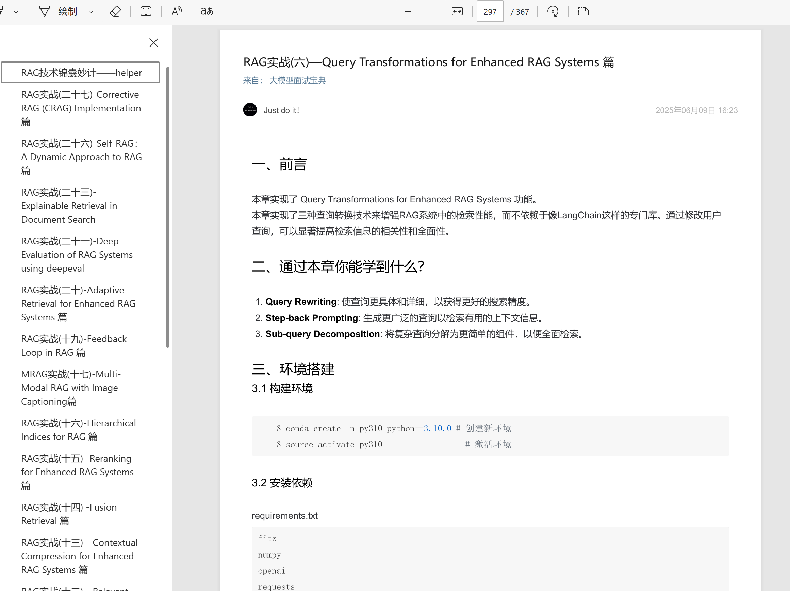

# ZSXQ-Spider
爬取知识星球内容，并制作成PDF电子书。

可以根据选择爬取知识星球 专栏|主题|文件 ，并制作 PDF 电子书。[https://www.zsxq.com/](https://www.zsxq.com/)

# 效果部分展示


## 功能

* 使用最新接口(v2)。
* 使用原生的HTML内容，保留原有格式。
* 使用playwright生成pdf，支持emoji表情。 
* 可控制下载特定专栏内容
* 专栏生成的pdf保存在zsxq_column_pdf/专栏名称/专栏名称.pdf。
* 精华主题生成的pdf保存在zsxq_topics_pdf/主题名称/主题名称.pdf。
* 文件下载保存在zsxq_files/下。
* 生成的pdf中保存了下载资源的ppt或者其他资源的链接。
* 注意使用脚本的时候不要开VPN。

## 环境配置
执行下面命令安装依赖：
```bash
conda create -n zsxq-spider python=3.8
conda activate zsxq-spider
pip install -r requirements.txt
playwright install chromium
```

## 用法
修改`config.py`文件中的参数，通过F12获取网页端的zsxq_access_token，user-agent，group_id，column_id（不设置则下载全部专栏）等信息。

然后运行python脚本：
```bash
python get_arctical.py
```

## 说明

1. 请大家合理使用本代码，不要随意传播生成的PDF，保护网站及作者的合法权益。
